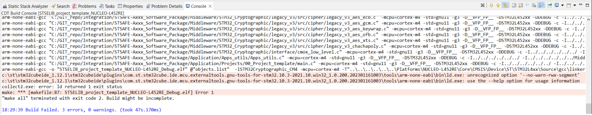
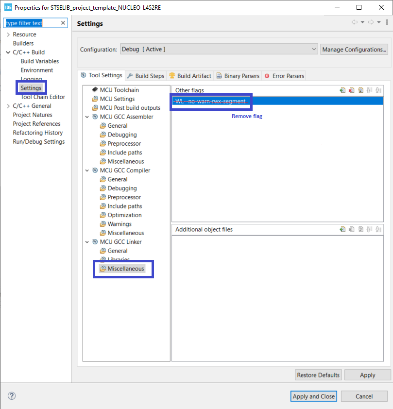

# Known issues

This documentation section describes the known issues with STSAFE-Axxx software package usage.

## 1 - Linker options STM32 CubeIDE / GCC toolcahin  

When compiling with a CubeIDE version below the following issue on linker flags prevent the project to compile  

it is possible to workaround the issue by removing the flags from project toolchain Linker settings. see screenshot below :

