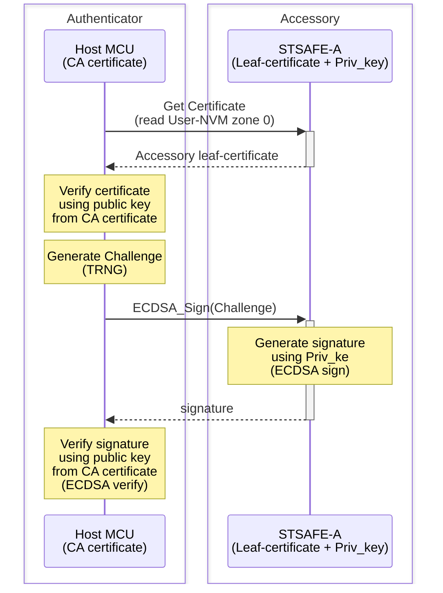
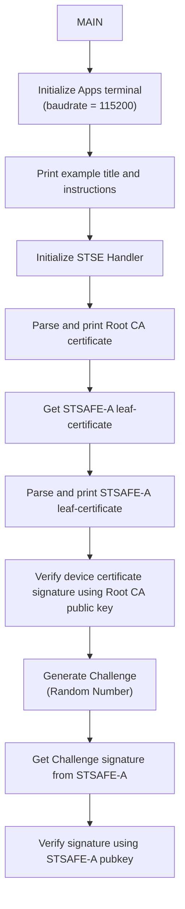
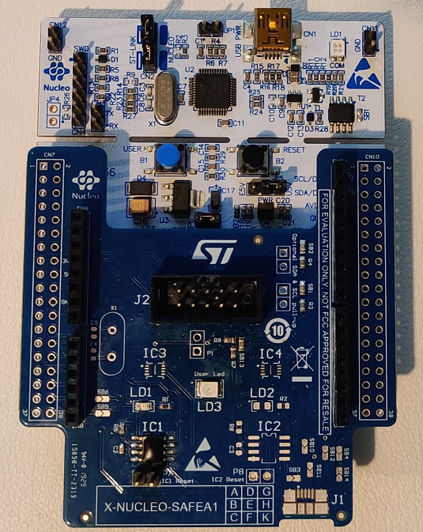

# STSAFE-A Accessory authentication

This project illustrates how to use the STSAFE-A Secure Element and STMicroelectronics Secure Element Library to perform device/accessory authentication.
When loaded on the target MCU platform , the project performes an STSAFE-A authentication . This authentication scheme is typicaly used in accessories authentication use cases.



The example applicative flowchart is illustrated below :



STSELib API used in the example are the following :

- stse_init
- stse_certificate_parse
- stse_certificate_print_parsed_cert
- stse_certificate_get_key_type
- stse_certificate_verify_signature
- stse_certificate_is_parent
- stse_ecc_generate_signature


## Hardware and Software Prerequisites 

- [NUCLEO-L452RE - STM32L452RE evaluation board](https://www.st.com/en/evaluation-tools/nucleo-l452re.html)

- [X-NUCLEO-SAFEA1 - Secure element expansion board](https://www.st.com/en/ecosystems/x-nucleo-safea1.html)

- [STM32CubeIDE - Integrated Development Environment for STM32](https://www.st.com/en/development-tools/stm32cubeide.html)

- Serial terminal PC software  (i.e. Teraterm)

## Getting started with the project

- Connect the [X-NUCLEO-SAFEA1](https://www.st.com/en/ecosystems/x-nucleo-safea1.html) expansion board on the top of the [NUCLEO-L452RE](https://www.st.com/en/evaluation-tools/nucleo-l452re.html) evaluation board. 



- Connect the board to the development computer and Open and configure a terminal software as follow (i.e. Teraterm).


- Open the STM32CubeIDE projects located in Application/Projects/STM32CubeIDE

- Build the project by clicking the “**Build the active configurations of selected projects\ **” button and verify that no error is reported by the GCC compiler/Linker.

- Launch a debug session then wait the debugger to stop on the first main routine instruction and press Start button to execute the main routine.

> [!NOTE]  
> - Jumper P7 (RST control) must be left open to communicate with the target STSAFE-A110.
> - The COM port can differ from board to board. Please refer to windows device manager.

<b>Result</b> :

This project reports execution log through the on-board STLINK CDC bridge.
These logs can be analyzed on development computer using a serial terminal application (i.e.: Teraterm).
As example below.

```
----------------------------------------------------------------------------------------------------------------
-                          STSAFE-A110 Multi-Steps Device Authentication Example                               -
----------------------------------------------------------------------------------------------------------------
- This example illustrates STSAFE-A110 device authentication process using Multi-Step approach.                -
- it can be taken as reference for building distant server authentication use cases.                           -
----------------------------------------------------------------------------------------------------------------
 - Initialize target STSAFE-A110

## CA self-signed certificate :

         x509 Version: 3
        SerialNumber: 01
         Issuer:
                 CountryName: NL
                 OrganizationalName: STMicroelectronics nv
                 CommonName: STM STSAFE-A PROD CA 01
         Subject:
                 CountryName: NL
                 OrganizationalName: STMicroelectronics nv
                 CommonName: STM STSAFE-A PROD CA 01
         Validity:
                 Not Before: 2018-07-27 00:00:00
                 Not After:  2048-07-27 00:00:00
         SignatureAlgorithm: ecdsa-with-SHA256
         tbsSignature: ecdsa-with-SHA256
         EllipticCurve: P-256
         Cert PubKey (Uncompressed):
                 X: 82194F26CCA36E0E82195CE66658EC64A466922F58C9E64B5DE1A29E7F39863D
                 Y: 042692E4C8AC79F96D2FED52774D52819539F21F3ECD1938F83D70AEE09CCD8D
         Cert Signature:
                 r: 6EE5433247AC7234FC9D175AA51E83276901ADEC1F005E371F40734DE38CC52E
                 s :B1D9516AAD9A3E86D22B8E3B3BD0146FABB9B922F0452634FE927FF5D636CD90
         List of Extensions:
                 BasicConstraints: Critical. CA certificate.

## Target STSAFE-Axxx certificate :

         x509 Version: 3
        SerialNumber: 020930C56159E439520139
         Issuer:
                 CountryName: NL
                 OrganizationalName: STMicroelectronics nv
                 CommonName: STM STSAFE-A PROD CA 01
         Subject:
                 CountryName: FR
                 OrganizationalName: STMicroelectronics
                 CommonName: eval3-020930C56159E439520139
         Validity:
                 Not Before: 2021-03-05 00:00:00
                 Not After:  2051-03-05 00:00:00
         SignatureAlgorithm: ecdsa-with-SHA256
         tbsSignature: ecdsa-with-SHA256
         EllipticCurve: P-256
         Cert PubKey (Uncompressed):
                 X: F52FEE40179DB073E84200AFA3FEE6A396B4C590F97D5EF0D3CEBDC68EDB2CFD
                 Y: F02DC53CB602D91D7EEC3CF046A5E6C1B7906692E57D8F44201EE466C5EE3ED0
         Cert Signature:
                 r: D3E6E6F40871781960DF5FBA941A98C88068202262AB0C67F38ECC7C0AF047C3
                 s :6A0E5460D9D7251A6E1A6244775A9334DF1121CC00ACFEBB9C85FEA6FD14C80C
         List of Extensions:

## Device Certificate Verified


## Host random challenge :

  0x81 0x7A 0x48 0xE6 0x16 0xB7 0x4B 0xF4 0xBE 0x4C 0x31 0x9B 0x85 0x7C 0x07 0xC0
  0x3C 0xDD 0x2D 0xFB 0x84 0x17 0xDC 0xDA 0x71 0x5F 0xC9 0xE0 0x9F 0x92 0x30 0x79

## Device signature over Host challenge:
  0x80 0xA9 0xC5 0xED 0x16 0x90 0x3E 0x1D 0x7B 0xEA 0xBB 0x10 0x92 0xB3 0x0D 0xE2
  0x23 0x4A 0xCD 0xF7 0xBA 0x07 0xC0 0x59 0x98 0x95 0xD0 0x99 0x2A 0x50 0x2D 0x9A
  0x2A 0x83 0x0D 0x9D 0xC6 0xCA 0xEC 0xCC 0x5F 0xCE 0xAD 0x2B 0x9D 0xC0 0xEE 0x3C
  0x05 0xC2 0xB1 0xC1 0x7B 0xD5 0x5C 0x19 0x72 0xEB 0x24 0xA7 0xD4 0x42 0xD1 0x72

# ## Device Authenticated (Challenge signature verified successfully)
```