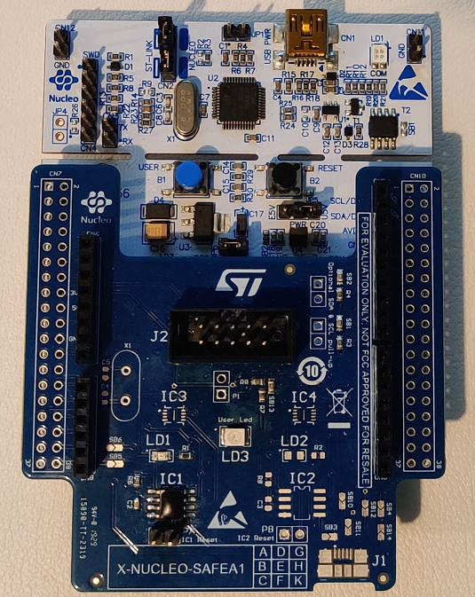
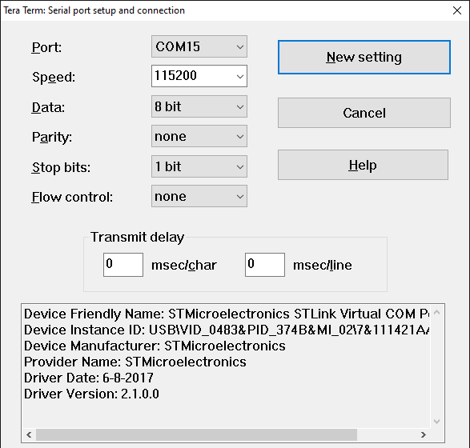
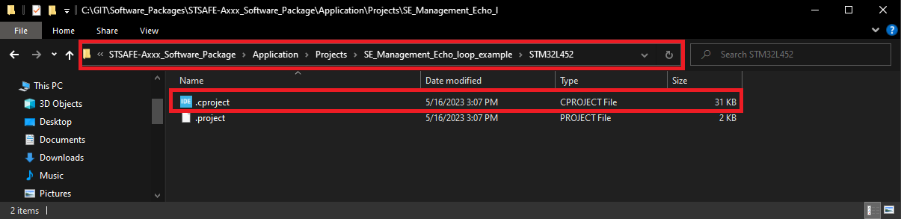
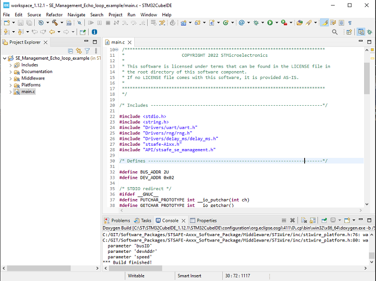
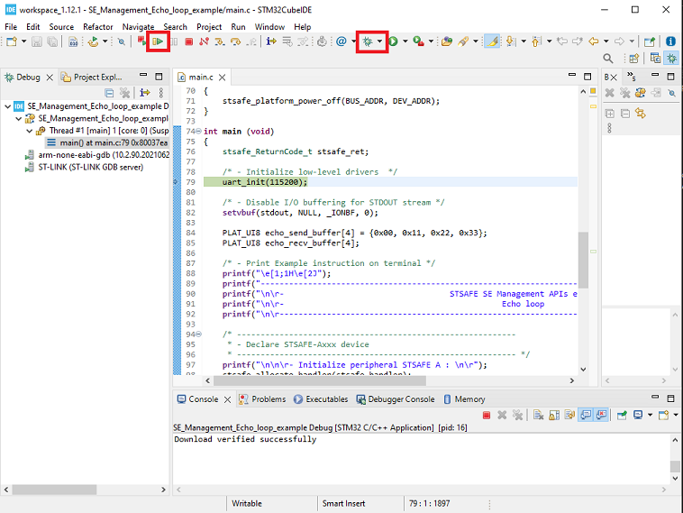
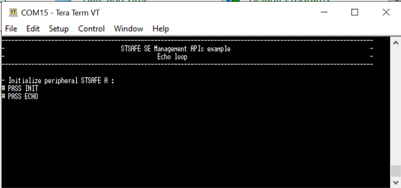

# Getting Started

This documentation section describes how to get started with the STMicroelectronics STSAFE-Axxx Secure Element and its development ecosystem. 

## Prerequisites

Following prerequisites are required to run through the process described in this section.

- Hardware prerequisites 
  - STM32L452 NUCLEO board
  - X-NUCLEO-STSAFEA1 expansion board 
  - 1x micro USB cable 

- Software  prerequisites 
  - STM32CubeIDE
  - STSAFE-Axxx Software package
  - Serial terminal PC software  (i.e. Teraterm)

## Hardware Setup 

- **STEP 1 :** Connect the STSAFE-A110 Nucleo expansion board on the top of the Host STM32 Nucleo board. As shown in picture below.

*Note : Jumper P7 (RST control) must be left open to communicate with the target STSAFE-A110*.

- **STEP 2 :** Connect the board to the development computer and Open and configure a terminal software as follow (i.e. Teraterm).

  

  ​	*Note : The COM port can differ from board to board. Please refer to windows "device manager" panel*;.

## Software Setup

- **STEP 1 :** Open one of the projects provided within the STSAFE-Axxx software package by double clicking on its “**.project** ” file.  as shown in picture below.

- **STEP 2 :** When loaded, the STM32 Cube IDE will display the project as follow.

- **STEP 3 :** Build the project by clicking the “**Build the active configurations of selected projects\ **” button and verify that no error is reported by the GCC compiler/Linker. 

- **STEP 4 :** Launch a debug session then wait the debugger to stop on the first main routine 
  instruction and press Start button to execute the main routine. 

   

- **Result :**  

Each project example reports execution log through the on-board STLINK CDC bridge. 
These logs can be analyzed on development computer using a serial terminal application (i.e.: Teraterm). 
As example below.

