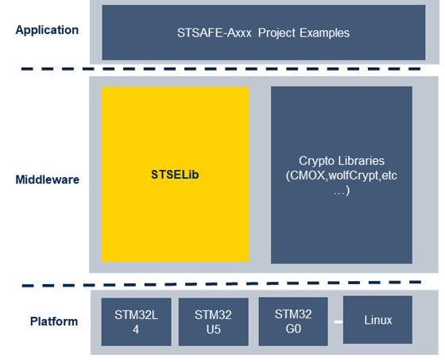

# STSAFE-A120 Accessory Authentication project 

This project illustrate how to use the STSAFE-A120 SE and the STSELib provided by STMicroelectronics to protect an accessory .

# Project Architecture 

- **Application Layer**

This layer contains the project use cases examples  illustrating the use of STSAFE-A120 Secure Elements devices on the different hardware development platforms provided by STMicroelectronics.

- **Middleware Layer** 

  - **STM32 Cryptographics library (CMOX)**
  
    The STM32 cryptographic library (CMOX) includes all the major security algorithms for encryption, hashing, message authentication, and digital signing.
  
  - **STSecureElement library (STSELib)** 
  
    STMicroelectronics Secure Element library providing a complete set of high-level APIs and core services to interface with STMicroelectronics Secure Element device family.

- **Platforms**

Optimized integrated peripheral drivers for STM32 MCUs. Can be used as reference for porting the framework on other platforms.